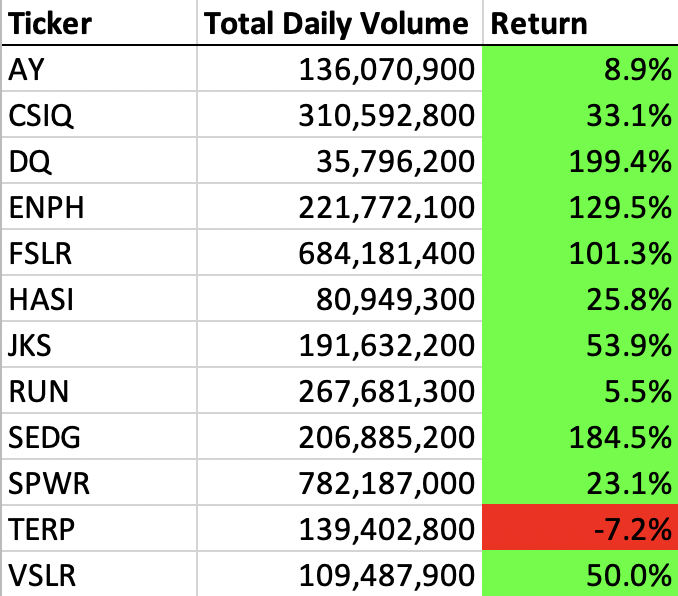
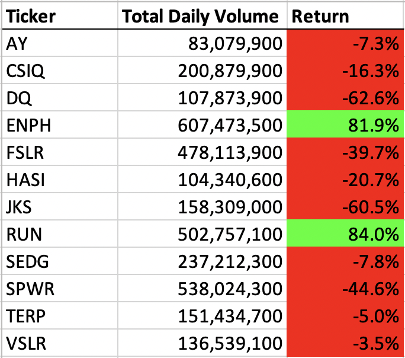
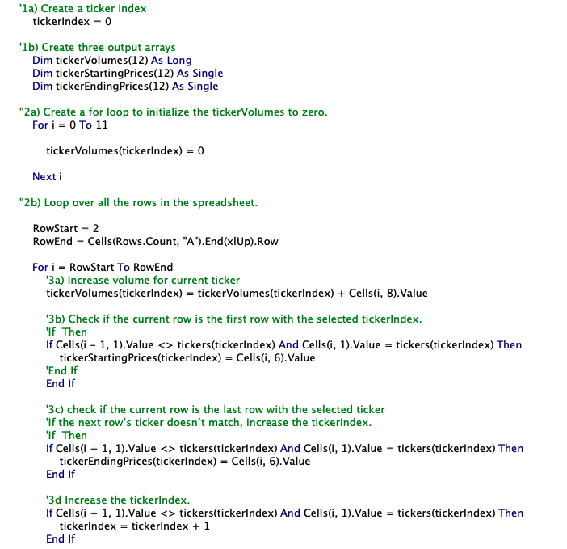
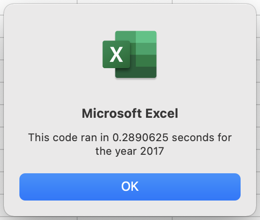
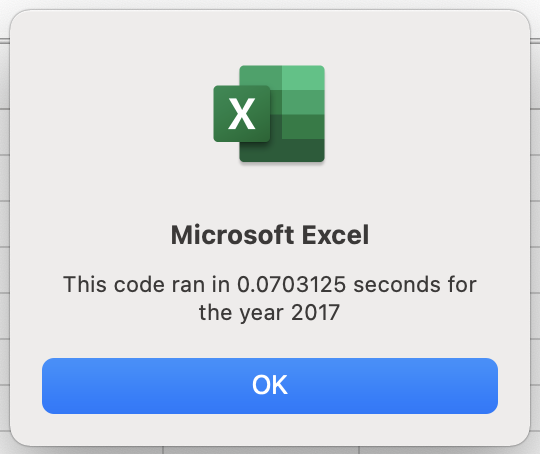
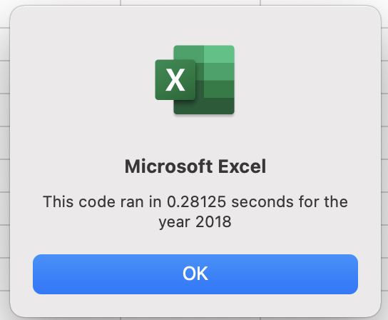
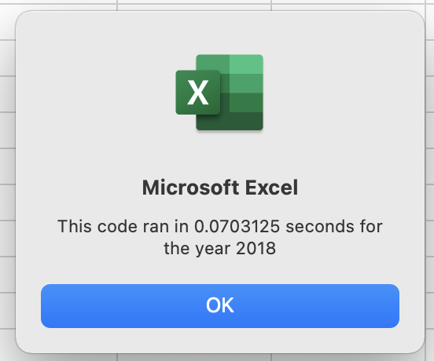

# Stock Analysis with VBA

*Prepared for Steve - 2021 JAN 10*

## Overview of Project

### Purpose

The main purpose of this analysis is to refactor the current code in order to allow the dataset to include the entire stock market over the last few years. The orginal code (*please see **background** below*), although functioning, would take far too long to execute with thousands of stocks. The aim is to have the ability to loop through all the data at one time.

### Background

This workbook was intitially created to analyze a dataset of stocks for the years of 2017 and 2018, specifically for the assessment of the client - *Steve* - and his parents, regarding where to put their investment money.

## Results

### Stock Performance

* 2017 was overall a more successful year for the stock market, with only one ticker with a negative return *(see 2017 Returns image below)*

* 2018 proved to be a much more difficult year, with all but 2 tickers with negative returns *(see 2018 Returns image below)*

Overall, **ENPH** and **RUN** are the most promising to invest in, with postive returns in years 2017 and 2018.

### Code Performance

It is clear that refactoring the code to allow for the dataset to be looped through all at once has enabled Steve to access the stock returns much faster, therefore proving to be useful for larger datasets with thousands of stocks. The code below shows how a tickerIndex was utilized to allow for the macro to run and the dataset to be processed all at once.

The specific timer comparisons for the original VBA Script and the Refactored Code is as follows:

The images above show that the time was reduced by roughly 4 fold, proving that the refactored code performed well.

## Summary

### Advantages & Disadvantages

Smoother programming, debugging, and code base that is easier to maintain are all advantages of refactoring code. The typical clear and concise outcome of refactored code promotes easy readability. That being said, when in the process of refactoring code, one may introduce bugs when refactored incorrectly.

### Pros & Cons 

Specifically to this particular dataset, refactoring has a practical application to the orginal VBA script as it enables thousands of stocks to be analyzed at one time. 
